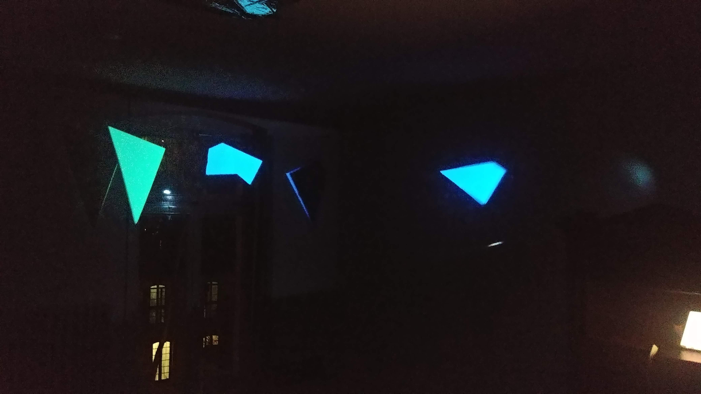

# lightshapes
This is a fun little side project that I did for a party. It uses a projector to project animations on cardboard shapes like this:

## How to

1. Cut out some shapes (polygons) from white cardboard (or glue white paper onto darker material), hang them up somewhere.
2. Align the projector so that all shapes are covered by its image.
3. Run `python find-polygons.py`, a window will show up. Move this window to your projector and make it fullscreen (you can exit any time with ESC). Use the cursor to find the edges of your cardboard shapes (arrow keys to move the cursor, space to set edge, return to go to next polygon). Close the window.
4. Run `python animate.py`, another window with the animations will show up. Again, move this window to your projector and make it fullscreen. The animations should now be aligned with the polygons you selected before, everything else should be black. Some of the animations are controlled via music, so make sure your laptop mic is not covered up.

## Requirements

Python 3, pygame, sounddevice, numpy, matplotlib, shapely
